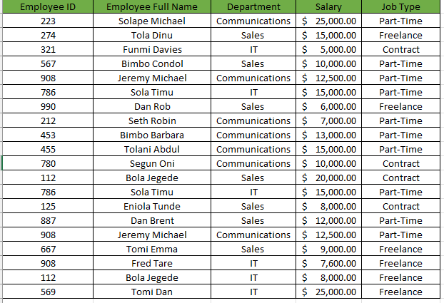

# Employee Data Analysis.
----

## Introduction
----
#### This data presents Employee Information including Employee ID, Employee Full Name, Department (Communications, Sales, I.T), Salary (between $5000 to $25000) and Job type (Part-time, Freelance, Contract) in 20 rows and 5 columns. 

