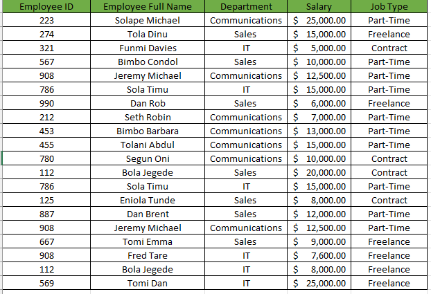
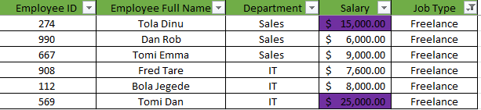

# Employee Data Analysis.
----

## Introduction
----
#### This data presents Employee Information including Employee ID, Employee Full Name, Department (Communications, Sales, I.T), Salary (between $5000 to $25000) and Job type (Part-time, Freelance, Contract) in 20 rows and 5 columns. 

#### Analysis of this data was carried out to showcase basic beginner’s technical abilities as listed below:
1. Employees who are ‘Freelancers’ and highlight the ones whose salaries are above $10000
2. Spliting the employees’ full names into first name and last name and checking for duplicates and highlight if any without deleting.
3. Highlighting employees whose names begin with the letter ‘E’ (in yellow) and formating of the Salary column such that the highest SALARY has a green background, and the lowest SALARY has a red background.
## Analysis Results
#### Employees who are ‘Freelancers’ and highlight the ones whose salaries are above $10000
This was carried out using filter and conditional formatting tools.

